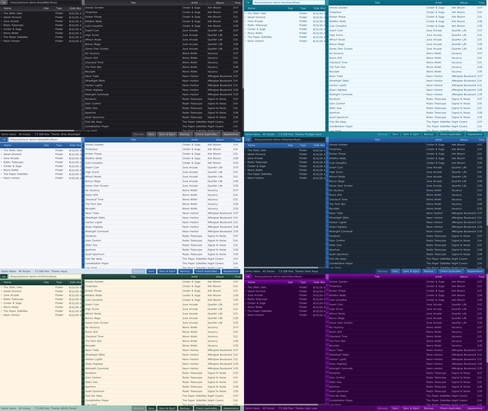

<h1>

PodRacer
</h1>

<pre style="font-family: ui-monospace, SFMono-Regular, Menlo, Consolas, 'Liberation Mono', monospace; font-style: italic;">
 ____           _ ____                     
|  _ \ ___   __| |  _ \ __ _  ___ ___ _ __ 
| |_) / _ \ / _` | |_) / _` |/ __/ _ \ '__|
|  __/ (_) | (_| |  _ < (_| | (_|  __/ |   
|_|   \___/ \__,_|_| \_\__,_|\___\___|_|  
</pre>

Transfer music to an iPod from Linux without iTunes. 

**Plug in the iPod, open PodRacer, drag music over.**

Midnight-commander-style two-pane UI: browse your music folder on the left, see what is on the iPod on the right. Manual sync, automatic duplicate avoidance, auto-transcode via ffmpeg.

## Compatibility

| Device generation | Supported? | Tested on Physical Hardware? |
| --- | --- | --- |
| iPod nano 3G | Yes | Yes |
| iPod nano 1G–2G | Yes | No |
| iPod classic 1G–5.5G | Yes | No |
| iPod mini | Yes | No |
| iPod nano 4G+ | No | No |
| iPod classic 6G/7G | No | No |
| iPod shuffle | No | No |
| iPod touch | No | No |

nano 4G+ and classic 6G/7G (iTunesSD format) are planned.

## Themes

Six of the thirteen built-in themes, rendered in demo mode (synthetic data only). Run `./podracer --demo` to preview any theme with a mock library, nothing real is touched.

## Run it

- From the repo: `scripts/build_onefile.sh` produces `./podracer` (one file, ~90 MB). Symlink it into your PATH: `ln -s "$PWD/podracer" ~/.local/bin/podracer`. Launch from a terminal or double-click.
- From source: `PYTHONPATH=src python3 -m podracer.main`

## Development

- Python 3.13, PySide6 (Qt6) — UI (`src/`)
- `podracer_db` — pure-stdlib iTunesDB codec (`packages/podracer_db/`, own PyPI dist)
- ffmpeg — tagging + transcoding to MP3
- `scripts/extract_fixtures.py` — pull the DB + sample tracks from a real iPod for tests
- Tests: `python3 -m unittest discover -s tests -t . -v` (stdlib only)

